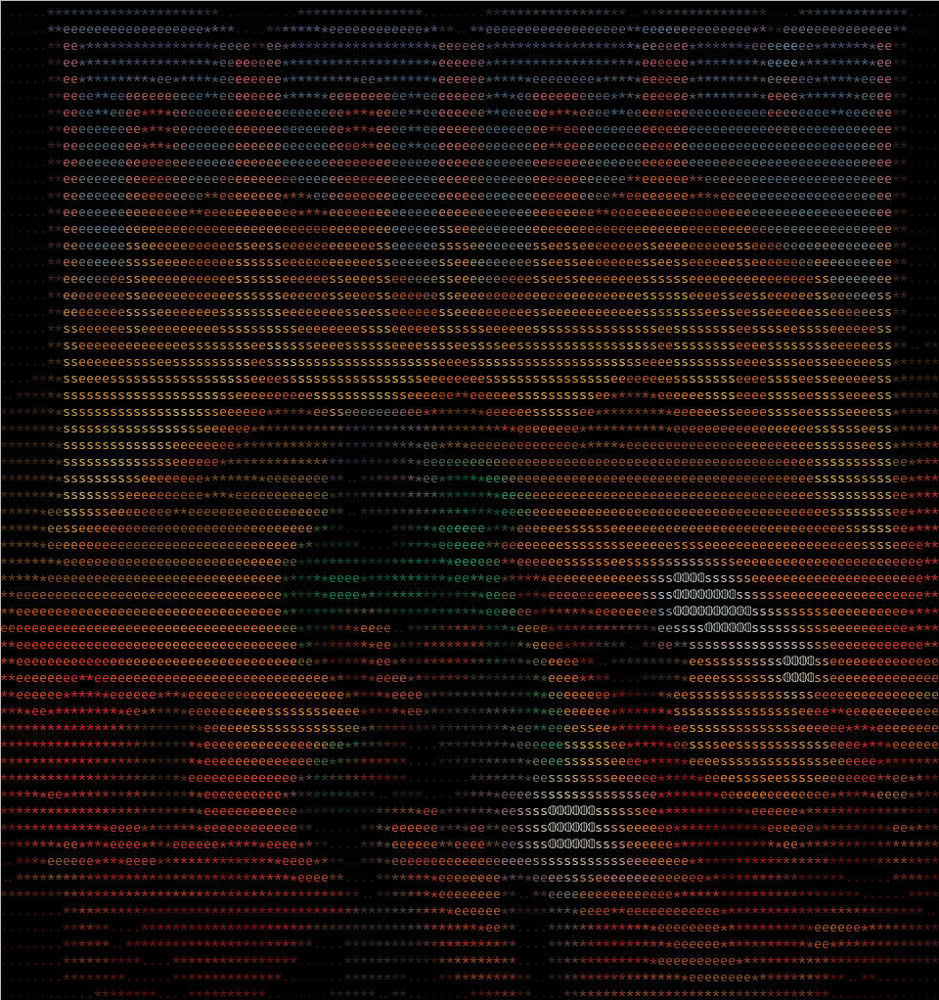

Transform images and videos to ascii with a cli tool or rust crate.<br>

<br>
https://www.youtube.com/watch?v=-JT_XlLnAas

# Dependencies
You will need ffmpeg and linux.

# Installation
## cli
```
cargo install paxcii
```

## crate
https://crates.io/crates/paxcii

# How to use
For the cli the help message will tell you all you need.<br>

For the crate there are the [docs](https://docs.rs/paxcii/latest/paxcii/).<br>
You can also take a look at the cli source code, it's an example on how to use the crate.